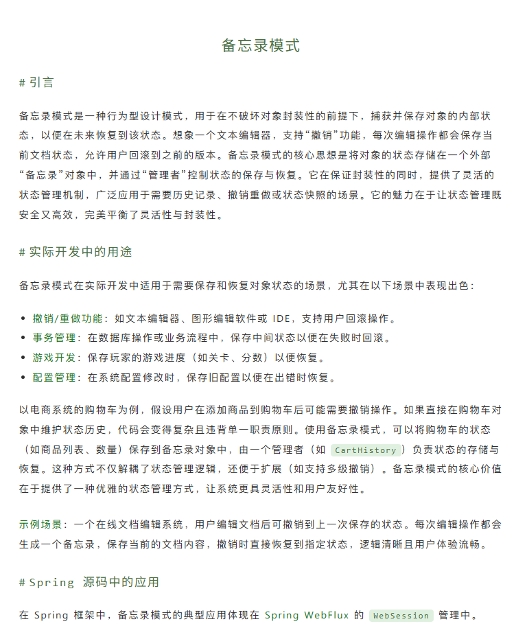
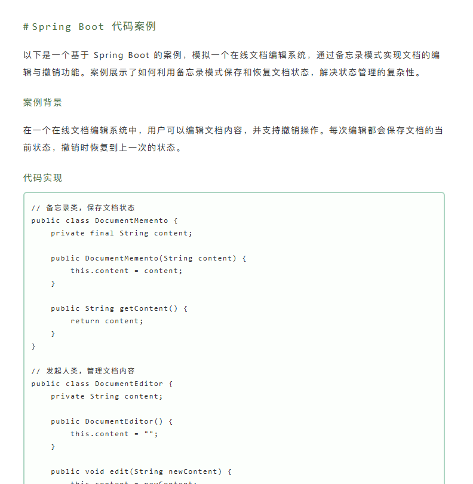

# juejin-markdown-theme green-beans

## 社区主题
主题名称 : green-beans

中文名 : 绿豆

主题地址 : [green-beans](https://github.com/YeWen-Yuan/green-beans)

作者 : [ApeAssistant]((Ape)[https://juejin.cn/user/2023560267436312])

## 主题描述
主色调为绿色，整体风格清新自然，适合喜欢简约风格的用户。

## 主题预览

## License

MIT
